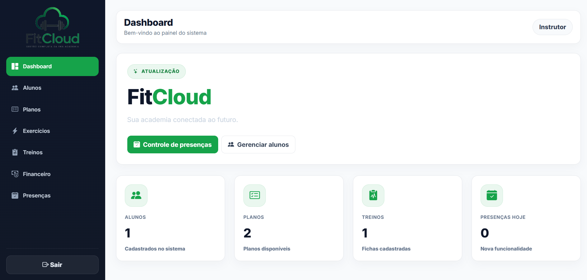
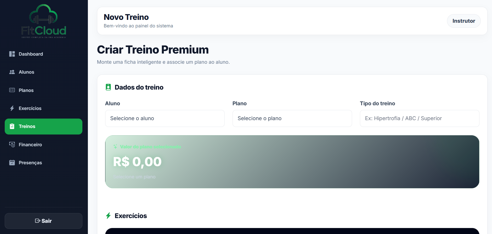
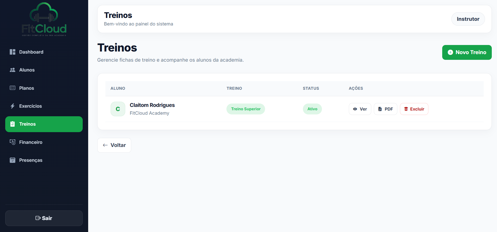
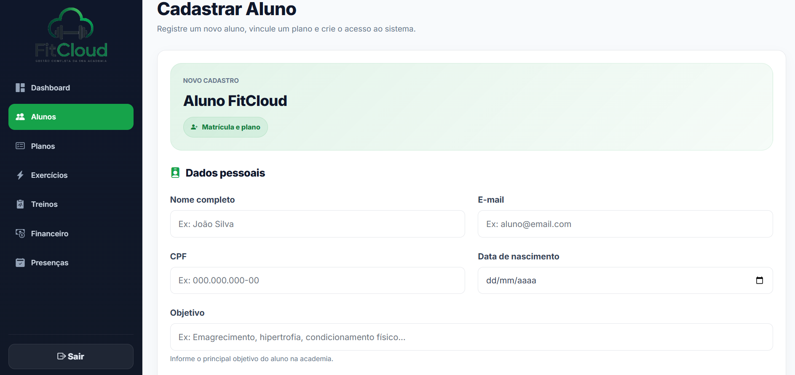
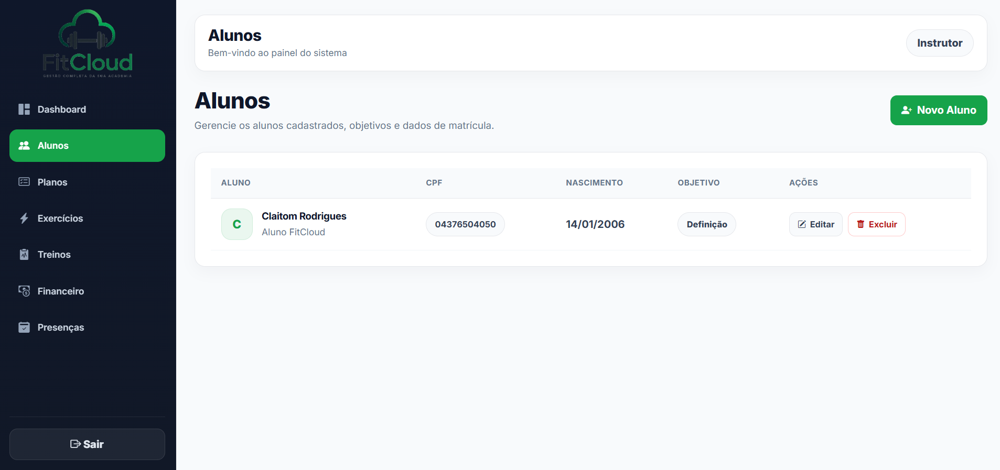
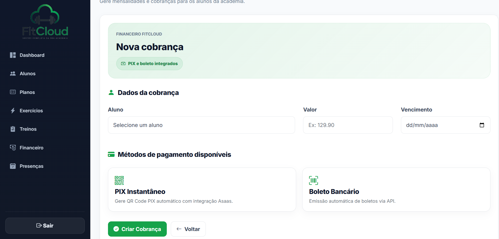
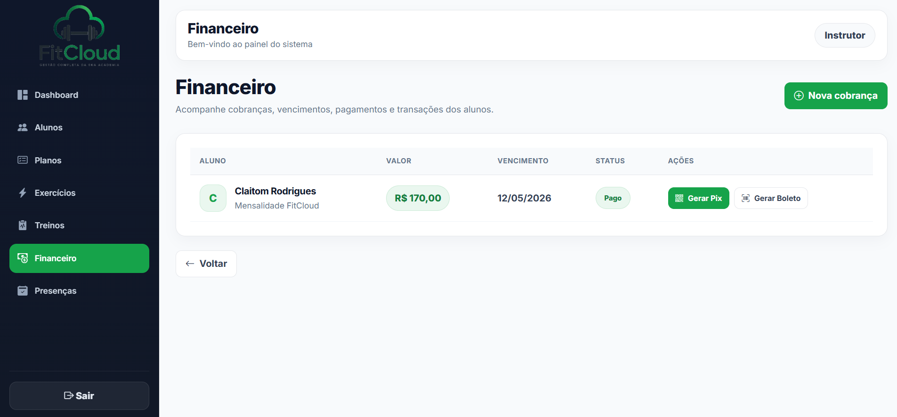
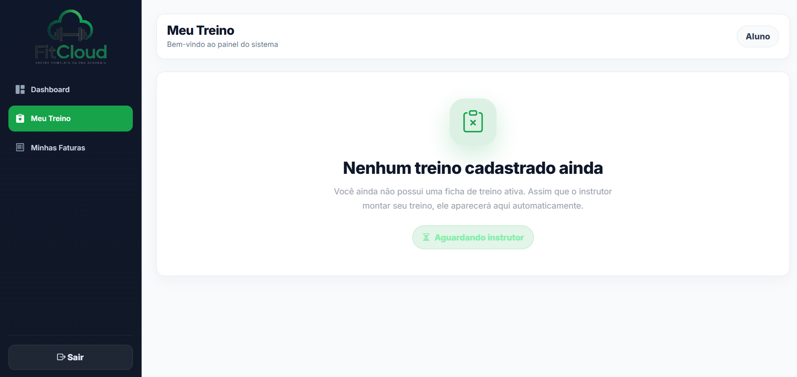
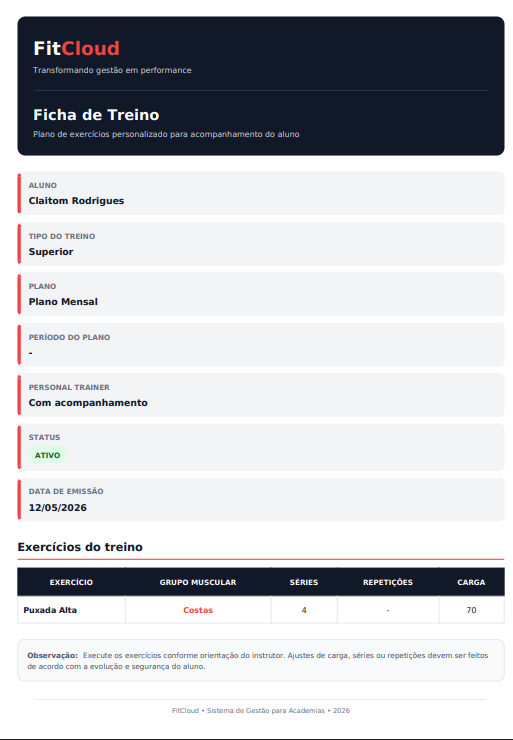
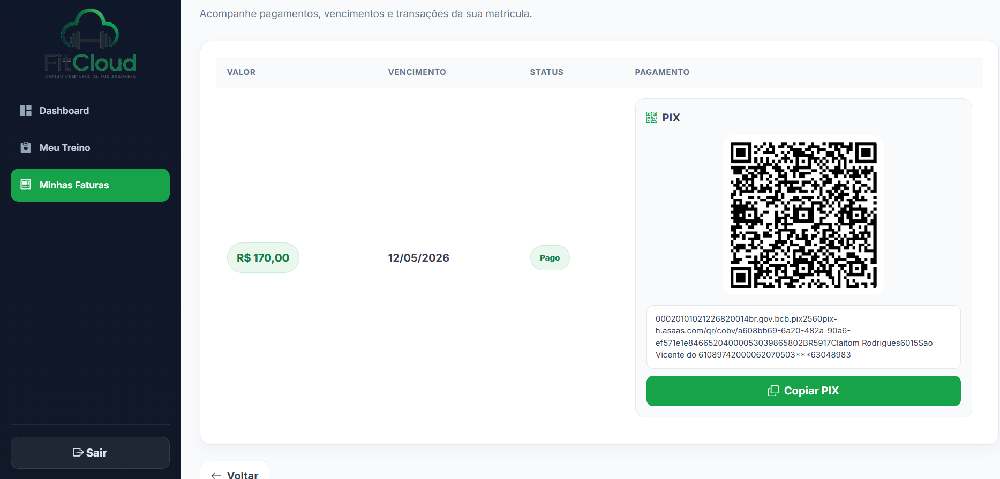

# FitCloud — Sistema Inteligente para Gestão de Academias

<p align="center">
  
</p>

<p align="center">
  <b>Uma plataforma completa para modernizar a gestão de academias.</b><br>
  Gerencie alunos, planos, treinos, pagamentos e presenças em um único sistema.
</p>

---

## Sobre o Projeto

O **FitCloud** é um sistema web desenvolvido para otimizar a administração de academias, centralizando todas as rotinas operacionais em uma plataforma moderna, intuitiva e segura.

A aplicação foi submetida a um processo de **reengenharia de software**, incorporando novas funcionalidades, modernização da interface e melhorias estruturais, proporcionando maior organização, desempenho e experiência ao usuário.

---

## Principais Funcionalidades

### Gestão de Alunos

- Cadastro e gerenciamento de alunos
- Controle de informações pessoais
- Histórico cadastral

### Gestão de Planos e Matrículas

- Cadastro de planos
- Controle de matrículas
- Situação da matrícula
- Valor final personalizado

### Gestão de Treinos

- Cadastro de exercícios
- Criação de treinos personalizados
- Séries, repetições e carga
- Organização por grupos musculares

### Controle Financeiro

- Cadastro de cobranças
- Registro de pagamentos
- Histórico financeiro
- Controle de mensalidades

### Controle de Presenças

- Registro diário de presença
- Consulta por aluno
- Consulta por data
- Histórico de frequência

### Portal do Aluno

- Visualização do treino atual
- Consulta das mensalidades
- Download da ficha de treino em PDF

### Dashboard Administrativo

- Total de alunos
- Matrículas ativas
- Controle financeiro
- Presenças registradas
- Indicadores gerenciais

---

# Reengenharia do Sistema

Durante o processo de reengenharia foram implementadas diversas melhorias estruturais e funcionais.

## Novas funcionalidades

- Controle de Presenças
- Novo Dashboard
- Melhor organização dos módulos
- Melhorias na navegação
- Interface redesenhada

## Melhorias de Interface

- Nova identidade visual
- Layout inspirado em plataformas SaaS
- Sidebar moderna
- Dashboard remodelado
- Cards mais limpos
- Botões padronizados
- Melhor organização das telas
- Tipografia moderna
- Melhor experiência do usuário

## Melhorias Técnicas

- Organização do código seguindo MVC
- Refatoração das Views
- Padronização dos componentes
- Melhor organização das rotas
- Melhorias no banco de dados
- Novos relacionamentos
- Código mais organizado e escalável

---

## Tecnologias Utilizadas

| Tecnologia | Descrição |
|------------|-----------|
| Laravel 12 | Framework PHP |
| PHP 8 | Linguagem de programação |
| SQLite | Banco de dados |
| Bootstrap 5 | Interface |
| Blade | Engine de Templates |
| JavaScript | Front-end |
| DomPDF | Geração de PDF |

---

## Arquitetura

O projeto utiliza a arquitetura **MVC (Model–View–Controller)**, proporcionando melhor organização do código, reutilização de componentes e facilidade de manutenção.

Principais padrões utilizados:

- MVC
- Eloquent ORM
- Blade Templates
- Migrations
- Relacionamentos entre entidades
- Componentização das interfaces

---
## Demonstração do Sistema

Login


###  Área do Instrutor

 Dashboard do Instrutor  


 Criação de Treino  



 Gestão de Alunos  



 Gestão de Transações



---

### Área do Aluno

 Treino Ativo  


 Ficha de Treino em PDF  


 Minhas Faturas


## Instalação

```bash
git clone https://github.com/claitomrodrigues/sistema-academia-laravel.git

cd sistema-academia-laravel

composer install

cp .env.example .env

php artisan key:generate

php artisan migrate

php artisan serve
```

---

## Próximas Implementações

- QR Code para registro de presença
- Avaliação física
- Evolução por medidas corporais
- Notificações automáticas
- Aplicativo mobile
- API REST
- Integração com meios de pagamento

---

## Licença

Este projeto é distribuído sob a licença MIT.
